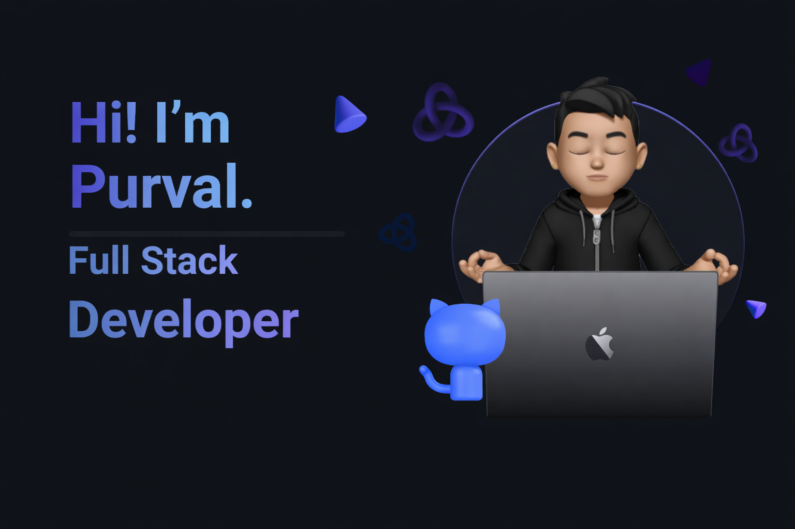

# 👋 Hi, I'm Purval Kanade

  

I'm a passionate developer who loves building web and software projects!  
I enjoy learning new technologies and collaborating on open source 🌐.

---

## 🚀 About Me

- 🔭 I’m currently working on cool web apps and fun projects
- 🌱 I’m currently learning backend and cloud development
- 👯 I love collaborating on open-source
- 💬 Ask me about JavaScript, React, Python, and project ideas!

---

## 🛠️ Tech Stack

### 🧠 Languages
 
  
  

### 🛠️ Frameworks & Tools
  
  

---

## 📊 GitHub Stats

---

## 📫 Connect With Me

- 📧 Email: purvalkanade25@gmail.com  
- 💼 LinkedIn: (https://www.linkedin.com/in/purval-kanade-developer-5b6108131/)  
- 🌍 Portfolio: https://your-portfolio.com

